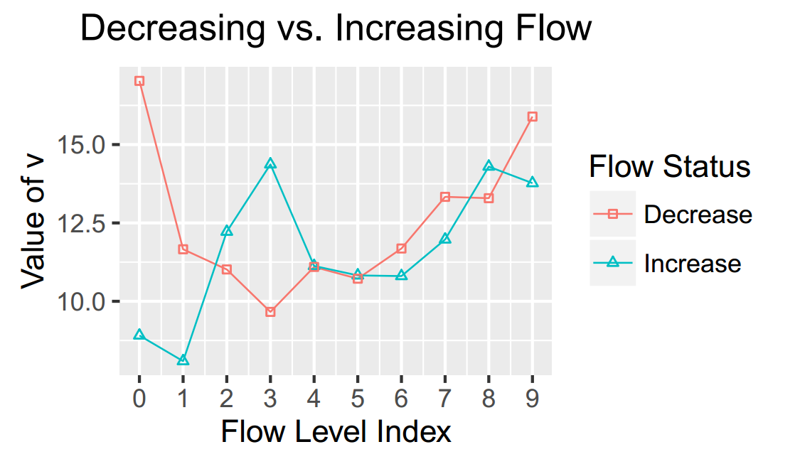
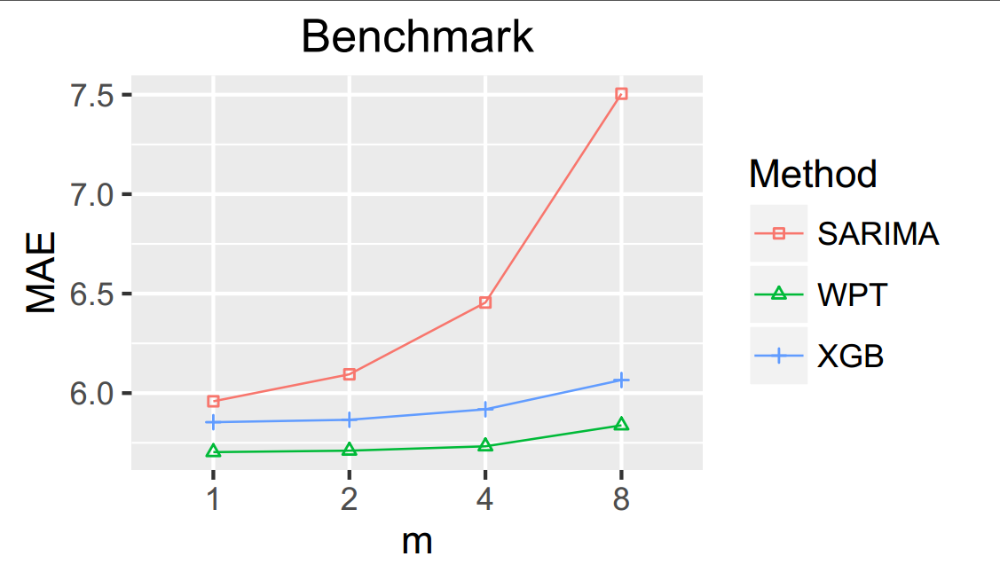

# Flow-Aware WPT k-Nearest Neighbours Regression for Short-Term Traffic Prediction
Choosing the right parameter values for kNN is problematic.
We propose weighted parameter tuples (WPT) to calculate weighted average dynamically according to flow rate.

# Usage of Code
Level 1 code is available in repo: [level 1](https://github.com/SunnyBingoMe/code_knn_level1_cuda), which is used to generate parameters' combinations' results.
Level 2 code is available here as R files.
Note: the implementation is not considering the data as stream as it just make the handling of data non-necessaryly more complex than evaluation's requirement, more like an industry software.


# Results
The results show that flow-aware WPT kNN performs better than manually tuned kNN as well as benchmark methods such as extreme gradient boosting (XGB) and seasonal autoregressive integrated moving average (SARIMA). 
Thus, it is recommended to use dynamic parameters regarding traffic flow and to consider all parameters at the same time.






# Citation Request
**[IEEE Format]** B. Sun, W. Cheng, P. Goswami, and G. Bai, “Flow-Aware WPT k-Nearest Neighbours Regression for Short-Term Traffic Prediction,” in IEEE Symposium on Computers and Communication (ISCC), Heraklion, Greece, 2017, pp. 48--53.

**[AAA Format]** Sun, Bin, Wei Cheng, Prashant Goswami, and Guohua Bai 2017Flow-Aware WPT K-Nearest Neighbours Regression for Short-Term Traffic Prediction. In IEEE Symposium on Computers and Communication (ISCC) Pp. 48--53. Heraklion, Greece: IEEE. http://ieeexplore.ieee.org/document/8024503/.

**[GB/T 7714-2005]** SUN B, CHENG W, GOSWAMI P等. Flow-Aware WPT k-Nearest Neighbours Regression for Short-Term Traffic Prediction[C]//IEEE Symposium on Computers and Communication (ISCC). Heraklion, Greece: IEEE, 2017: 48--53.

**[BibLatex]:**

```tex

@inproceedings{sun2017flowaware,
  location = {{Heraklion, Greece}},
  title = {Flow-{{Aware WPT}} k-{{Nearest Neighbours Regression}} for {{Short}}-{{Term Traffic Prediction}}},
  isbn = {978-1-5386-1628-4},
  url = {http://ieeexplore.ieee.org/document/8024503/},
  doi = {10.1109/ISCC.2017.8024503},
  eventtitle = {IEEE Symposium on Computers and Communication (ISCC)},
  booktitle = {{{IEEE Symposium}} on {{Computers}} and {{Communication}} ({{ISCC}})},
  publisher = {{IEEE}},
  author = {Sun, Bin and Cheng, Wei and Goswami, Prashant and Bai, Guohua},
  keywords = {background apps,Computers,Correlation,energy consumers,Energy consumption,energy efficiency,energy savings,IEEE 802.11 Standard,Job shop scheduling,multi-app scenarios,NetSense,network traffic scheduling,Processor scheduling,smart phones,smartphone traffic scheduling,telecommunication power management,telecommunication scheduling,Telecommunication traffic,traffic predictability,traffic traces},
  date = {2017-07},
  pages = {48--53}
}

```

# Paper
The full-text paper is available on [Github](https://github.com/SunnyBingoMe/sun2017flowaware-github/blob/master/sun2017flowaware-github.pdf), [Diva](http://urn.kb.se/resolve?urn=urn:nbn:se:bth-15208) and [ResearchGate](https://www.researchgate.net/publication/316940653_Flow-Aware_WPT_k-Nearest_Neighbours_Regression_for_Short-Term_Traffic_Prediction).

